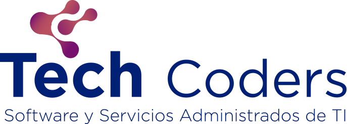

# Guia de Codificación Laravel

Para el uso del framework podemos hacer uso de esta página que recopila las
[mejores practicas en laravel](https://www.laravelbestpractices.com) adicional a esto podemos agregar lo siguiente:

## URL

1. Todas la urls deben ser declaradas con **guiones medios** cuando el nombre sea muy largo

```
protocolo://dominio/un-nombre-de-segmento-largo
```

## Vistas

1. Los nombres de las vistas, componentes y parciales deben ser con guiones bajos
2. Se deben de mantener las vistas lo mas limpio posible, es decir muchas veces le pasamos los datos a la vista y ahí los procesamos cosa que podemos hacer antes
3. Evitar el sudo de las etiquetas **@php**

## Controladores

3. Los controladores solo deben de tener métodos que estén vinculados con las rutas, es decir que por cada método del controlador
debe existir una ruta
4. En los controladores debemos evitar cargar los métodos de consultas a la base de datos, si tuvieras que realizar múltiples consultas
agrégaselas como métodos a sus respectivos modelos.

## Middleware

1. Deben ser agregados en el controlador NO en el archivo de rutas

```php
<?php

namespace App\Http\Controllers;

public class MiControlador extends Controller
{
    public function __construct()
    {
        $this->middleware('XXX');
    }
}
```